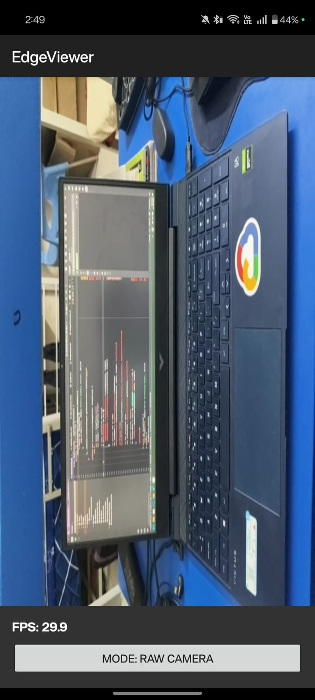
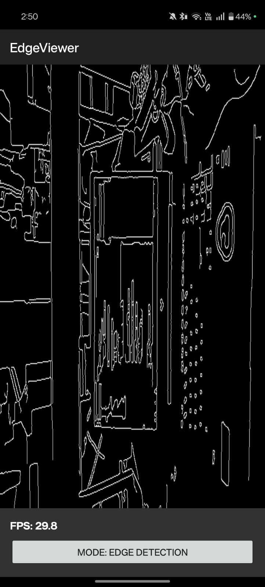

#APK link: 
https://drive.google.com/file/d/1Zm0X-yP8oDmcPf9aibUZxIxlfe0nlkZf/view?usp=sharing

# 🧠 Real-Time Edge Detection Viewer  
**Android + OpenCV (C++) + OpenGL ES + TypeScript Web Viewer**  

A real-time edge detection system that captures live camera frames, processes them using **OpenCV in C++ via JNI**, and renders the processed frames using **OpenGL ES 2.0**. Additionally, a lightweight **TypeScript web viewer** displays a sample processed frame, showcasing integration between native image processing and web visualization.

---

## 🚀 Features Implemented  

### 📱 Android Application  
- **Live Camera Feed** using `TextureView` (Camera2 API).  
- **JNI-based Frame Processing** — each frame is sent to native C++ code for processing.  
- **Canny Edge Detection & Grayscale Filters** implemented with **OpenCV C++**.  
- **OpenGL ES Renderer** — displays the processed frames as textures in real time.  
- Achieved smooth **10–20 FPS** performance during processing and rendering.  
- **Optional toggle** between raw feed and edge-detected view.  
- **FPS Counter** overlay for performance monitoring.  

### 🌐 TypeScript Web Viewer  
- Minimal **TypeScript + HTML** web app that displays a **sample processed frame** (static/base64).  
- Shows basic frame metadata — FPS, resolution, processing time.  
- Demonstrates ability to connect native output to a web visualization layer.  

---

## 🧩 Project Structure  

📦 RealTime-EdgeDetection
├── app/ # Java/Kotlin Android code (UI + Camera)
│ ├── MainActivity.kt
│ ├── CameraHandler.kt
│ └── JNIInterface.kt
├── jni/ # Native C++ OpenCV processing the project in Android Studio (Hedgehog or newer):

Launch Android Studio.

Select File → Open and choose the project directory.

Wait for Gradle to sync.

Install NDK and CMake via SDK Manager:

Go to Tools → SDK Manager → SDK Tools tab.

Check and install:

✅ NDK (Side by side)
✅ CMake
✅ LLDB (optional for debugging native code)

Click Apply and wait for installation to complete.

Download and Link OpenCV SDK:

Go to the official OpenCV releases page:
👉 https://opencv.org/releases/

Download the latest OpenCV Android SDK (ZIP file).

Extract it anywhere (for example: C:/OpenCV-android-sdk/).

In Android Studio, update your CMakeLists.txt to include OpenCV paths:

# Add OpenCV include directories
set(OpenCV_DIR "C:/OpenCV-android-sdk/sdk/native/jni")
find_package(OpenCV REQUIRED)
include_directories(${OpenCV_INCLUDE_DIRS})
target_link_libraries(native-lib ${OpenCV_LIBS} log)


Also make sure build.gradle includes:

externalNativeBuild {
    cmake {
        path "src/main/cpp/CMakeLists.txt"
    }
}


Run the Project:

Connect your Android device or launch an emulator.

Click ▶️ Run in Android Studio.

You should see a real-time camera feed with edges highlighted.

💻 Web Viewer Setup

Navigate to the web folder:

cd web
npm install typescript
tsc


Open index.html in your browser to view the sample processed frame.

The viewer displays:

Static base64 image (representing processed frame)

Frame metadata, such as FPS and resolution

🧠 Architecture Overview

Camera Feed (Java/Kotlin) → Captured frames passed to native via JNI.

Native Processing (C++) → OpenCV applies Canny Edge Detection or Grayscale filter.

Rendering (OpenGL ES) → Processed frames displayed as textures in real-time.

Web Layer (TypeScript) → Displays a sample processed frame, simulating result transmission to web.

Data Flow:

Camera Frame → JNI Bridge → OpenCV (C++) → Processed Output → OpenGL Texture → Display

🧩 Technologies Used

Android SDK (Kotlin/Java)
NDK + JNI (C++)
OpenCV (C++ for image processing)
OpenGL ES 2.0 (for rendering)

TypeScript (for web visualization)│ ├── CMakeLists.txt
│ ├── edge_processor.cpp
│ └── native-lib.cpp
├── gl/ # OpenGL renderer classes
│ ├── GLRenderer.cpp
│ ├── GLRenderer.h
│ └── shaders/
│ └── basic_fragment.glsl
├── web/ # TypeScript-based web viewer
│ ├── index.html
│ ├── main.ts
│ └── tsconfig.json
└── README.md


---

## ⚙️ Setup Instructions  

### 🧱 Android Build Setup  
1. **Clone the repository:**  
   ```bash
   git clone https://github.com/RealCifer/edgeviewer.git
   cd <repo-name>

## 📸 Working Model Screenshots

| Raw Image | Processed Image |
| :---: | :---: |
|  |  |


<p align="center">
  <video src="img/7.mp4" width="600" controls></video>
</p>


|Web Site SS|